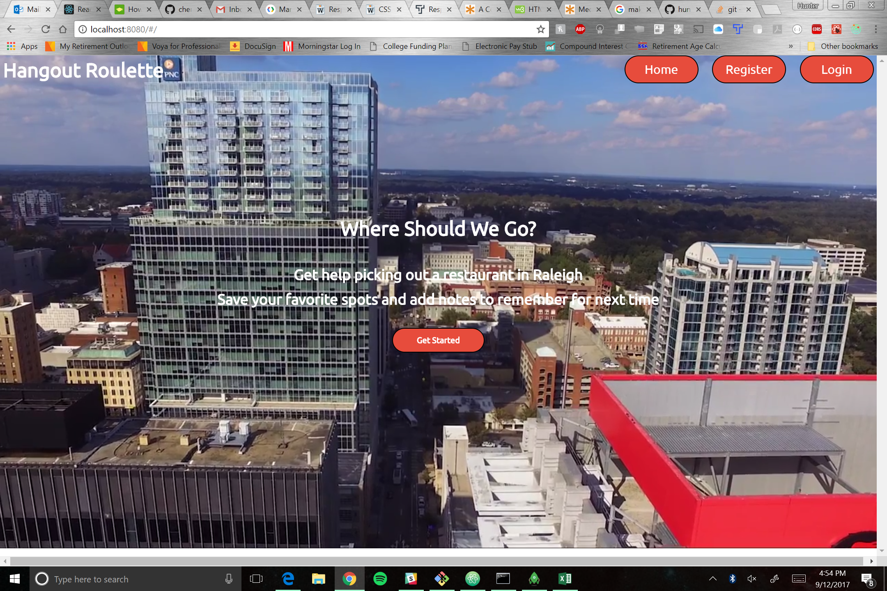
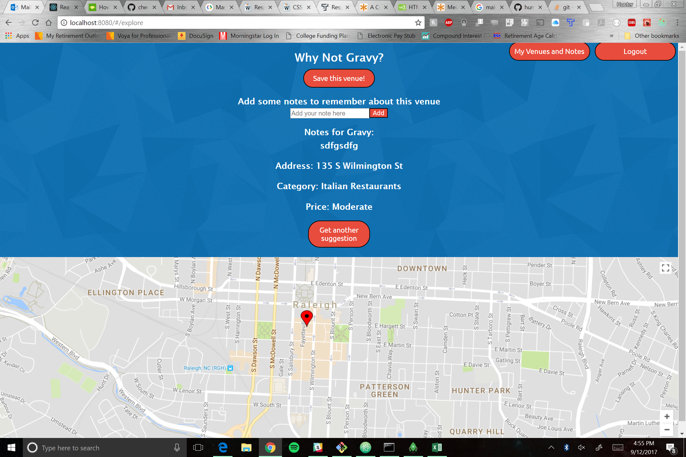

# Hangout Roulette

A way to simplify the age old of question of "Where should we go to eat?"

Functionality for different areas in Raleigh for bars and restaurants coming soon!

## The Basics

### Creating an Account

* To create an account, click on the Register button from the Home Page
* Select a username and password
* This will redirect you to the login screen, where you will enter the username and password you just created

### Using the App

* Upon logging in the app will provide you with a venue to and some basic information about it
* You can choose to save the venue to your saved list
* Once a venue is saved, you can add notes to be seen later (on both the main Explore page and your Profile page)
* The venue currently being listed shows up on Google maps

### Your Profile

* When you click the "My Venues and Notes" button you will link to the venues and corresponding notes taken for them
* You can try the best food around you and remember what was good and what wasn't
